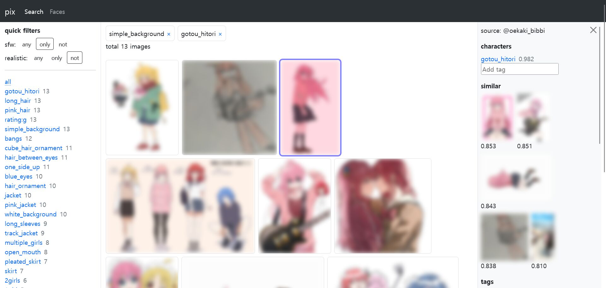

# pix

**pix** is a Personal Image eXplorer.

I made it to easily find images in the tweets I liked. It automatically scrapes liked tweets, and then categorizes them with style/character/person tags. A simple Web-based interface exists for browsing and managing the library.

## Screenshot

(images are blurred intentionally)

## Features

* Automatically add images to the library from your X (Twitter) likes
* Automatically extract sensitivity/style/character tags from images (based on [WaifuDiffusion v1.4 Tags](https://huggingface.co/spaces/SmilingWolf/wd-v1-4-tags))
* Automatically find faces (based on [InsightFace](https://github.com/deepinsight/insightface)) and cluster them to identify person in the images
* Browse images by tag(s)/person
* Browse similar images

## To-dos

* Train custom autotaggers for the characters that can't be identified in the pre-trained model _(in progress)_
* Alternative embedding models for image similarity search
